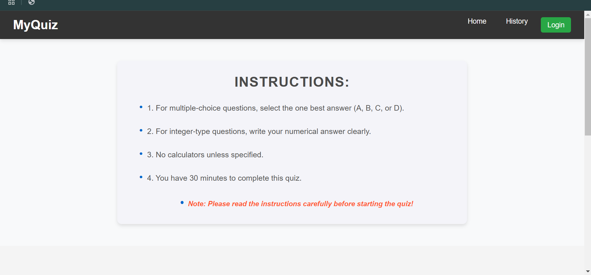
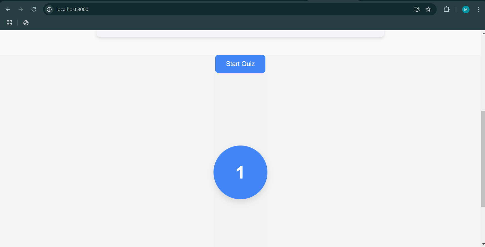
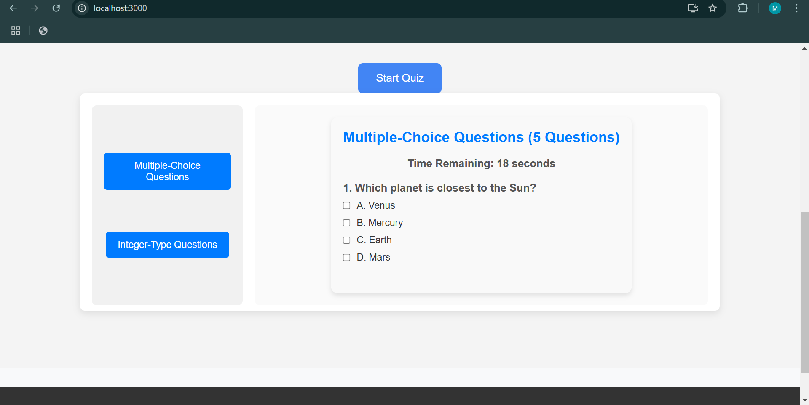
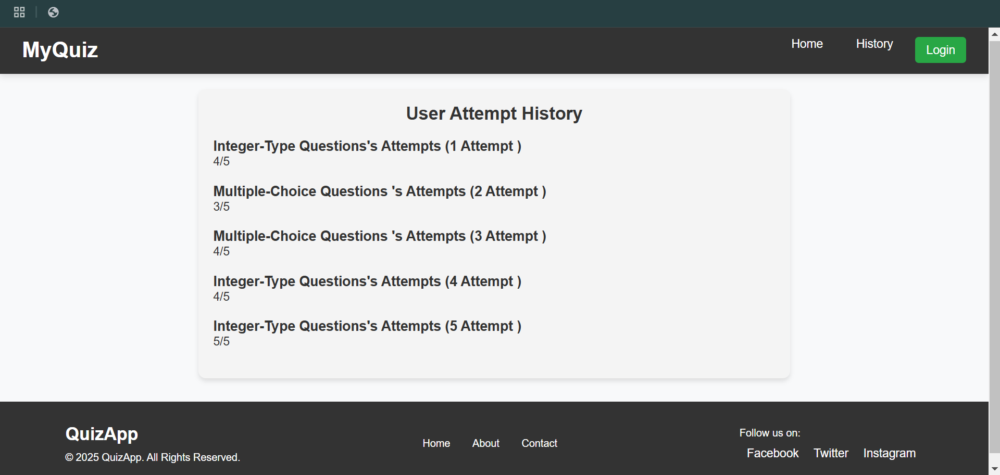

# Quiz App with Firebase Authentication and MongoDB

This is a quiz application that allows users to take a quiz with multiple-choice and integer-type questions. It leverages Firebase for Google authentication and MongoDB to store user data and quiz attempts. The backend is powered by Node.js and Express.

## Features

- **User Authentication**: Firebase Google authentication for secure login and sign-up.
- **Quiz**: Users can take a quiz with multiple-choice questions.
- **History**: Users can view their past quiz attempts and answers.
- **Timer**: A countdown timer for each question.
- **Backend**: MongoDB is used to store user data and quiz results. Node.js and Express handle the backend API.

## Technologies Used

- **Frontend**: React.js
- **Backend**: Node.js, Express.js
- **Database**: MongoDB
- **Authentication**: Firebase Google Authentication
- **Styling**: CSS (for user interface)

## Running the Application Locally

### Prerequisites

Before running the app, make sure you have the following installed:

1. **Node.js** (https://nodejs.org/)
2. **MongoDB** (You can use a local MongoDB setup or MongoDB Atlas for cloud hosting)
3. **Firebase account** (for Google authentication setup)

### Backend Setup

1. Clone the repository:

    ```bash
    git clone https://github.com/maheshkumar77/Quizapp.git
    cd quiz-app
    ```

2. Install the dependencies for the backend:

    ```bash
    cd backend
    npm install
    ```

3. Create a `.env` file inside the `backend` directory and add the following environment variables:

    ```bash
    MONGO_URI=your-mongodb-uri
    FIREBASE_API_KEY=your-firebase-api-key
    FIREBASE_AUTH_DOMAIN=your-firebase-auth-domain
    FIREBASE_PROJECT_ID=your-firebase-project-id
    FIREBASE_STORAGE_BUCKET=your-firebase-storage-bucket
    FIREBASE_MESSAGING_SENDER_ID=your-firebase-sender-id
    FIREBASE_APP_ID=your-firebase-app-id
    ```

4. Start the backend server:

    ```bash
    npm start
    ```

    The backend server should now be running on `http://localhost:5000`.

### Frontend Setup

1. In a new terminal window, navigate to the frontend directory:

    ```bash
    cd frontend
    ```

2. Install the dependencies for the frontend:

    ```bash
    npm install
    ```

3. Start the React development server:

    ```bash
    npm start
    ```

    The frontend should now be running on `http://localhost:3000`.

### Accessing the Application

After both the frontend and backend are running, you can access the application locally in your browser:

- Frontend: [http://localhost:3000](http://localhost:3000)
- Backend: [http://localhost:5000](http://localhost:5000)

### Firebase Setup

1. Go to the [Firebase Console](https://console.firebase.google.com/), create a new project, and enable **Google Authentication** in the **Authentication** section.
2. Get your Firebase project configuration and update the `.env` file in the `backend` folder with the correct keys.

### MongoDB Setup

1. Create a MongoDB database and collection (or use MongoDB Atlas for cloud-hosted MongoDB).
2. Update the MongoDB URI in the `.env` file.

## Deployed App

- You can access the deployed version of the app at: [Your App Link Here](https://vermillion-cupcake-ead9e8.netlify.app/)

## API Endpoints

Here are the main endpoints of the backend API:


- **POST /attempt**: Submits the quiz attempts and stores the result.
- **GET /history**: Retrieves a user's quiz history and answers.

## Screenshots

### Home Page



### Quiz Page



### QuizHistoy


## Conclusion

This is a fully functional quiz app with secure authentication using Firebase and MongoDB as the database. Users can log in using Google, take quizzes, and view their quiz history.

## License

This project is licensed under the MIT License - see the [LICENSE](LICENSE) file for details.
